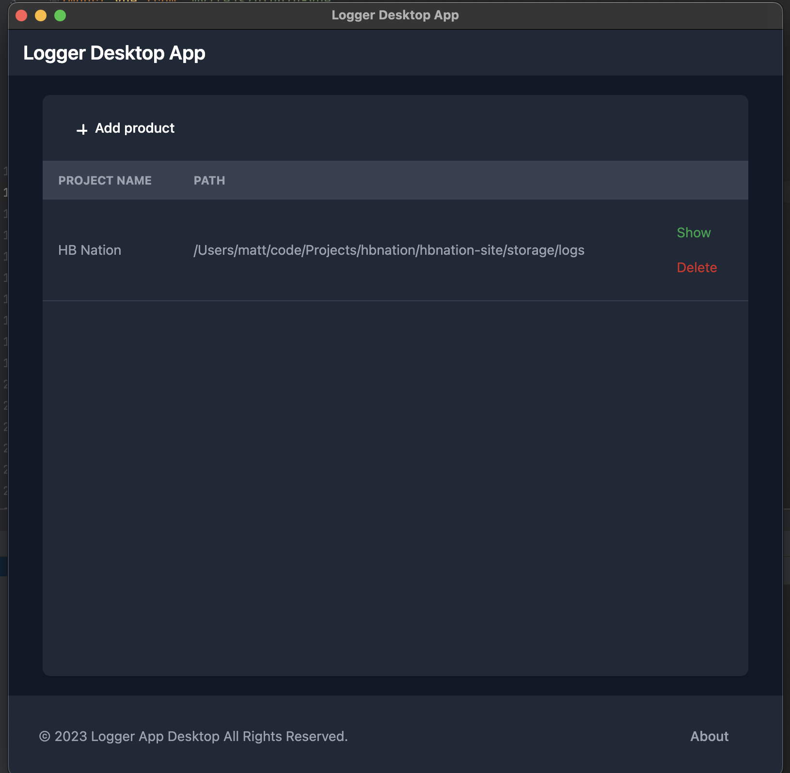
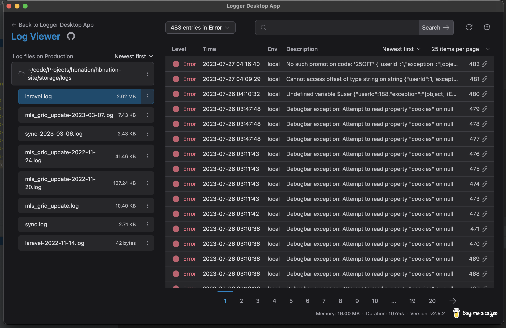

# Desktop Logger App

## Description
Basically a [NativePHP](https://github.com/NativePHP/laravel) wrapper around [Opcodes Log Viewer](https://github.com/opcodesio/log-viewer). 
It's a simple app that allows you to view the log files for all your local laravel projects without installing any dependencies in them.
The frontend is built using Vue and TailwindCSS.

## Development Installation
1. Clone the repo
2. Run `cp .env.example .env`
3. Run `composer install`
4. Run `npm install`
5. Run `npm run dev`
6. Run `php artisan key:generate`
7. Run `php artisan native:serve`

## Usage

- Select a folder with Laravel logs
- Click show to view logs for that project
- View logs
